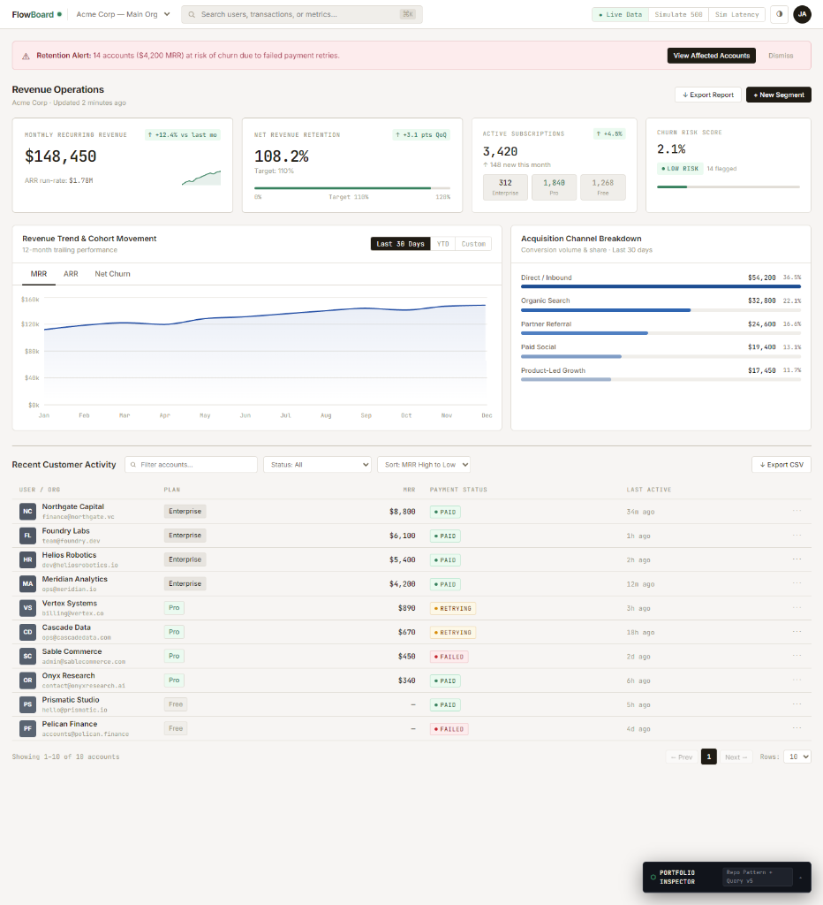
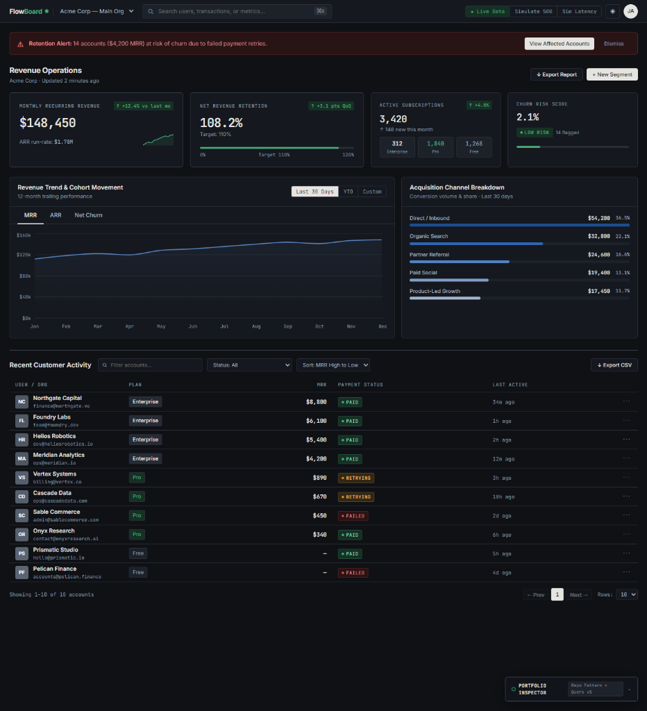
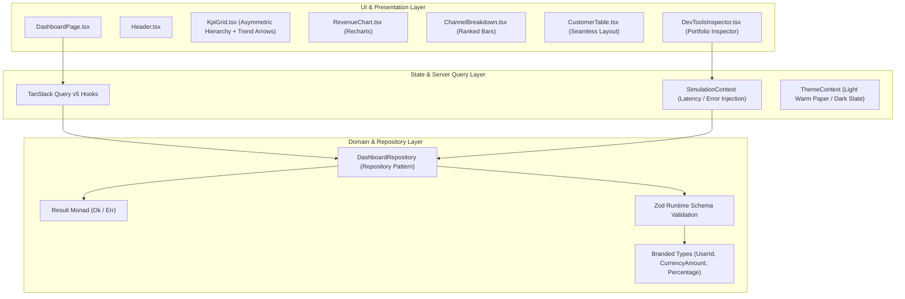

# FlowBoard — Revenue & Retention Operations Board

> A high-density, production-ready SaaS Revenue Operations & Churn Intelligence dashboard built with React 18, TypeScript 5.7, TanStack Query v5, and a testable Repository Pattern.

[Live Demo](https://flowboard-rouge.vercel.app) | [Source Code](https://github.com/nadiaescobbb/flowboard-ui)

---

## 📸 Visual Overview



*Warm Paper Theme (Light Mode)*



*Carbon Slate Theme (Dark Mode)*

---

## 🎯 Case Study & Business Context

Unlike generic analytics templates that show disconnected metrics, **FlowBoard** is structured as an operational software system for SaaS revenue teams. It addresses both **Product/Business pain** (identifying customer churn risk and revenue movement) and **Engineering pain** (isolating API contracts from UI rendering).

### Key Product Features
- **Retention Risk & Anomaly Detection**: Banner alert targeting accounts at risk of churn due to payment retries with actionable segment filtering.
- **Asymmetric Revenue Telemetry**: Weighted KPI hierarchy prioritizing Monthly Recurring Revenue (MRR) and Net Revenue Retention (NRR) over supporting subscription metrics.
- **Ranked Channel Attribution**: Conversion breakdown rendered via horizontal progress bars for direct, effortless data scanning.
- **Seamless Operational Customer Table**: High-density table supporting debounced searching, status filtering (`Paid`, `Retrying`, `Failed`), multi-column sorting, pagination, and CSV exports.
- **Portfolio Inspector (Dev Controls)**: Embedded floating panel allowing evaluators to simulate 500 server errors, slow network latency (2000ms), and empty dataset responses directly in the live demo (collapsed by default).

---

## 🏗️ System Architecture



---

## 💡 Engineering Highlights & Trade-offs

### 1. Functional Error Handling with Result Monad
Instead of relying on fragile `try/catch` blocks or silent `catch` fallbacks, API methods return an explicit `Result<T, E>` monad:
```ts
export type Ok<T> = { readonly isOk: true; readonly value: T };
export type Err<E> = { readonly isOk: false; readonly error: E };
export type Result<T, E = Error> = Ok<T> | Err<E>;
```
This guarantees that error states are handled explicitly before passing data to TanStack Query.

### 2. Compile-Time Branded Types & Runtime Zod Schemas
To prevent accidental domain parameter mixups (e.g., passing a `KPIId` where a `UserId` is expected), domain primitives use **Branded Types**. Runtime boundary safety is ensured via Zod schema parsing before data reaches UI components:
```ts
export type UserId = string & { readonly __brand: unique symbol };
export type CurrencyAmount = number & { readonly __brand: unique symbol };
```

### 3. Systematic Refactoring UI Design System
Built following strict *Refactoring UI* engineering & accessibility principles:
- **Standardized 9-Step HSL Ramps (100–900)**: Closed color scales for Warm Paper neutrals (`--neutral-100` to `--neutral-900`) and data series (`--indigo-100` to `--indigo-900`), avoiding inline/random opacity tweaks.
- **3-Tier Semantic Color Tokens**: Alerts and badges use 3 coordinated HSL shades (`--danger-surface`, `--danger-border`, `--danger-text`) to preserve visual hierarchy without heavy dark block harshness.
- **Hue Shift & U-Curve Saturation**: Extrema shades boost saturation ($S: 70\%\text{--}85\%$) and shift Hue ($\Delta\text{Hue} \le 20^\circ$) towards bright Cyan ($198^\circ$) for light tints and deep Blue ($235^\circ$) for dark text to prevent muddy graying.
- **Perceptual Accessibility & Redundancy**: All KPI trends feature explicit directional arrows ($\uparrow / \downarrow$) and signs (`+ / -`) for colorblind usability, paired with inverted-contrast status pills (`PAID`, `RETRYING`, `FAILED`).
- **Color Temperature**: Warm Grey paper tint ($H: 40^\circ, S: 20\%$) in Light Mode; Cool Slate console ($H: 220^\circ, S: 22\%$) in Dark Mode.

---

## 🧪 Testing & Verification

The codebase maintains strict quality thresholds covering pure utilities, API adapters, and UI interactions:

```bash
# Run unit and integration tests
npm run test:run

# Run test coverage report (Target: 80%+)
npm run coverage

# Build production bundle
npm run build

# Run Playwright E2E browser tests
npm run e2e
```

---

## 🛠️ Tech Stack

| Layer | Tool | Rationale |
|---|---|---|
| Framework | React 18 | Declarative component architecture |
| Language | TypeScript 5.7 Strict | Domain type safety & branded types |
| Build Tool | Vite 6 | Instant HMR and optimized production bundles |
| Server State | TanStack Query v5 | Auto-caching, retries, and network state management |
| Charts | Recharts 2 | Responsive SVG data visualization |
| Validation | Zod | Runtime contract validation at data boundaries |
| Styling | HSL Design System Variables | Design tokens for Warm Paper / Carbon Slate themes |
| Testing | Vitest + RTL + Playwright | Unit, component, and E2E browser coverage |
