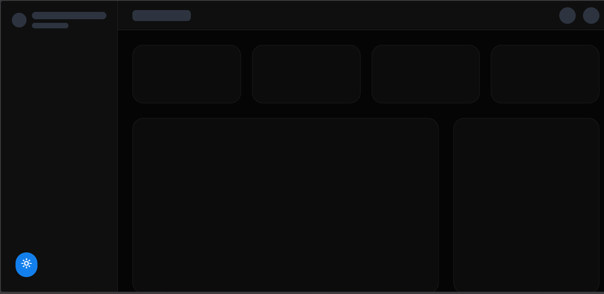

# FlowBoard — Analytics Dashboard

> **Portfolio project** · React 18 · TypeScript · TanStack Query · Vite · Tailwind CSS · Vitest

[](https://flowboard-rouge.vercel.app)
[](#tests)
[](https://www.typescriptlang.org/)
[](LICENSE)

---

## 📸 Previews

| Light Mode | Dark Mode |
|---|---|
|  |  |

| Mobile | Loading skeleton |
|---|---|
|  |  |

> **Note:** Screenshots are from the live deployment. Clone + `npm run dev` to see it locally.

---

## What problem does this project solve?

Most "dashboard" portfolio pieces are wrappers around a chart library with mock data. This project focuses on the **infrastructure decisions** that make a real dashboard production-ready:

1. **Data layer isolation** — the API module is swappable without touching UI components
2. **Type safety at boundaries** — branded types prevent mixing user IDs with KPI IDs at compile time
3. **Graceful degradation** — loading skeletons, error boundaries, and retry logic work independently
4. **Accessible by default** — ARIA roles, keyboard navigation, and screen reader labels are not afterthoughts

The goal was to show that I can make boring-but-important decisions, not just ship visually impressive demos.

---

## Quick Start

```bash
git clone https://github.com/nadiaescobbb/flowboard-dashboard.git
cd flowboard-dashboard

npm install
npm run dev          # http://localhost:5173

npm run test         # run unit tests
npm run test:ui      # Vitest UI in browser
npm run coverage     # coverage report
npm run build        # production build
```

**Requirements:** Node 18+

---

## Architecture

```
src/
├── api/              # Data fetching — isolated from UI
│   └── dashboard.ts  # Single source of truth for API shape
├── components/       # Presentational, no direct data fetching
│   ├── KPICard.tsx
│   ├── RevenueChart.tsx    # Custom SVG, no chart library
│   ├── AcquisitionChart.tsx
│   ├── UserTable.tsx       # Sort, filter, paginate
│   ├── DashboardSkeleton.tsx
│   ├── ErrorBoundary.tsx
│   └── ErrorState.tsx
├── contexts/
│   └── ThemeContext.tsx    # Persistent dark/light mode
├── hooks/
│   ├── useDashboardData.ts # TanStack Query abstraction
│   └── useThemeClasses.ts  # Memoized theme class map
├── pages/
│   └── Dashboard.tsx       # Composition root
├── types/
│   └── index.ts            # Branded types, discriminated unions
└── utils/
    ├── index.ts            # Pure functions (tested)
    └── index.test.ts       # Vitest test suite
```

---

## Technical Decisions

These are the actual choices made and why. Not everything worked perfectly — see [Honest tradeoffs](#honest-tradeoffs).

### 1. Custom SVG charts instead of Recharts/Chart.js

**Decision:** Built `RevenueChart` with raw SVG and bezier curves from scratch.

**Why:** Chart libraries are great for production, but portfolio reviewers know when you're hiding behind abstractions. Writing `generatePath`, `normalizeDataPoints`, and handling hover state manually demonstrates you understand coordinate math, viewBox transforms, and SVG rendering — skills that transfer to data visualization work.

**Tradeoff:** More code, harder to maintain, no built-in accessibility. A real production app would use a battle-tested library.

---

### 2. Branded Types for domain IDs

**Decision:**
```typescript
declare const __brand: unique symbol;
type Brand<T, B> = T & { [__brand]: B };

type UserId = Brand<string, 'UserId'>;
type KPIId  = Brand<string, 'KPIId'>;
```

**Why:** A common bug in dashboards is passing the wrong ID to the wrong function — both are `string`, TypeScript won't catch it. Branded types make this a compile error.

```typescript
// This would be a runtime bug without branded types:
fetchUser(kpiCard.id); // ✗ TypeScript error with branded types
```

**Tradeoff:** Requires casting at creation points (`id as UserId`). Worth it at domain boundaries, overkill for everything.

---

### 3. Result<T, E> type instead of throw/catch

**Decision:** Validators return `Result<T>` instead of throwing exceptions.

```typescript
// Before: caller needs try/catch, error type is unknown
const validate = (data: unknown): KPICard => { /* throws */ }

// After: caller handles both cases explicitly
const result = validateArrayOf(data, validateKPICard);
if (!result.ok) return showError(result.error);
// TypeScript knows result.value is KPICard[] here
```

**Why:** Exceptions are invisible in TypeScript function signatures. `Result<T, E>` makes error handling a type-level concern — the caller **must** handle failure, and TypeScript enforces it.

**Tradeoff:** More verbose. Not idiomatic React; third-party code still throws. Pragmatic approach: use Result at validation boundaries, try/catch for external calls.

---

### 4. TanStack Query for server state

**Decision:** All async data lives in TanStack Query, not `useState` + `useEffect`.

**Why:** `useEffect` for data fetching leads to race conditions, no deduplication, and manual loading/error state. TanStack Query handles all of this plus caching, background refetching, and retry logic with a consistent API.

```typescript
// useDashboardData.ts — the entire hook
export const useDashboardData = () => {
  const { theme } = useTheme();
  return useQuery({
    queryKey: ['dashboard', theme],  // re-fetches when theme changes
    queryFn: () => fetchDashboardData(theme),
    staleTime: 5 * 60 * 1000,
    retry: 2,
  });
};
```

Note: `queryKey` includes `theme` intentionally — different themes fetch different mock datasets.

---

### 5. Memoization strategy

**Decision:** Selective memoization — not `memo()` on everything.

What's memoized and why:
- `KPICard` — rendered in a grid, parent re-renders on theme change
- `SparklineSVG` — path calculation from array is expensive
- `RevenueChart` — SVG point calculation
- `UserTable` — sort + filter over user array

What's **not** memoized:
- `Header`, `Sidebar` — props don't change, React bailout is cheap enough
- `ErrorState`, `DashboardSkeleton` — render rarely, memo overhead not worth it

---

### 6. CSS Variables + Tailwind for theming

**Decision:** Theme implemented via Tailwind's `dark:` class variant + a `useThemeClasses` hook that returns a map of class strings.

```typescript
// Instead of conditional className strings everywhere:
const classes = useThemeClasses();
<div className={classes.surface}>...</div>

// The hook centralizes all theme logic:
surface: isLight ? 'bg-white border-gray-200' : 'bg-[#0f0f0f] border-white/8'
```

**Why:** Avoids scattered ternary expressions. Theme changes in one place. The hook is memoized so it only recomputes when theme changes.

---

### 7. Accessibility as a first-class concern

Every interactive element has:
- `aria-label` or `aria-labelledby`
- `role` attributes where semantic HTML isn't available
- `aria-expanded`, `aria-haspopup` on dropdowns
- `aria-current="page"` on active nav items
- `sr-only` headings for screen reader landmarks

The chart includes `role="img"` with `aria-label="Revenue trend chart"` — a common omission.

---

## Honest tradeoffs

Things that are **not** production-ready and why that's acceptable for a portfolio piece:

| Limitation | Why it exists | Production fix |
|---|---|---|
| Mock data, no real API | Portfolio constraint | Connect to any REST/GraphQL endpoint; the API layer is isolated for this reason |
| 10% random error rate in API mock | Demonstrates error boundary | Remove or make configurable |
| No E2E tests | Scope decision | Add Playwright for user flows |
| Recharts in dependencies but unused | Explored, replaced with custom SVG | Remove or keep for comparison |
| No virtualization in UserTable | Data set is small | Add `@tanstack/virtual` for 1000+ rows |
| CSS-only animations | Simple enough | Framer Motion for complex sequences |

---

## Tests

**Framework:** Vitest (same config as Vite, faster than Jest for this stack)

**Coverage:** utils and type validators — the only truly pure, side-effect-free code worth unit testing. Components are better tested with Playwright E2E.

```bash
npm run test          # watch mode
npm run test:run      # single run (CI)
npm run coverage      # coverage with thresholds (80%)
```

**What's tested:**

| Module | Cases |
|---|---|
| Type guards (`isUserStatus`, `isTrendDirection`) | Valid values, case sensitivity, null/undefined |
| `createPercentage` branded type | Valid range, out-of-range throws RangeError |
| `validateKPICard` | Happy path, empty id, invalid trend, empty/non-numeric chartData |
| `validateUser` | Happy path, optional avatar, invalid email, invalid status |
| `validateAcquisitionChannel` | Percentage bounds, opacity bounds, empty name |
| `validateArrayOf` | Non-array input, minLength, index in error message |
| `formatCurrency` | Integer formatting, rounding, other currencies |
| `formatPercentage` | Positive/negative signs, decimal places |
| `normalizeDataPoints` | Empty input, single point, bounds, zero-range values |
| `buildSvgPath` | Empty, single point, bezier curve presence |
| `buildAreaPath` | Empty path, closure point |
| `Result<T>` helpers | ok/err wrappers |

---

## Tech Stack

| Layer | Choice | Reason |
|---|---|---|
| Framework | React 18 | Industry standard, concurrent features ready |
| Language | TypeScript (strict) | Type safety at domain boundaries |
| Build | Vite 5 | Fast HMR, ESM native |
| Data fetching | TanStack Query v5 | Server state management done right |
| Styling | Tailwind CSS v3 | Utility-first, no CSS-in-JS runtime overhead |
| Testing | Vitest | Same config as Vite, no extra setup |
| Deployment | Vercel | Zero-config, automatic preview deployments |

---

## License

© 2026 Nadia. All rights reserved. Portfolio use only.

---

## Contact

- LinkedIn: [nadiaescobbb](https://www.linkedin.com/in/nadiaescobbb/)
- Email: nadiaescobbb@gmail.com
- GitHub: [@nadiaescobbb](https://github.com/nadiaescobbb)
